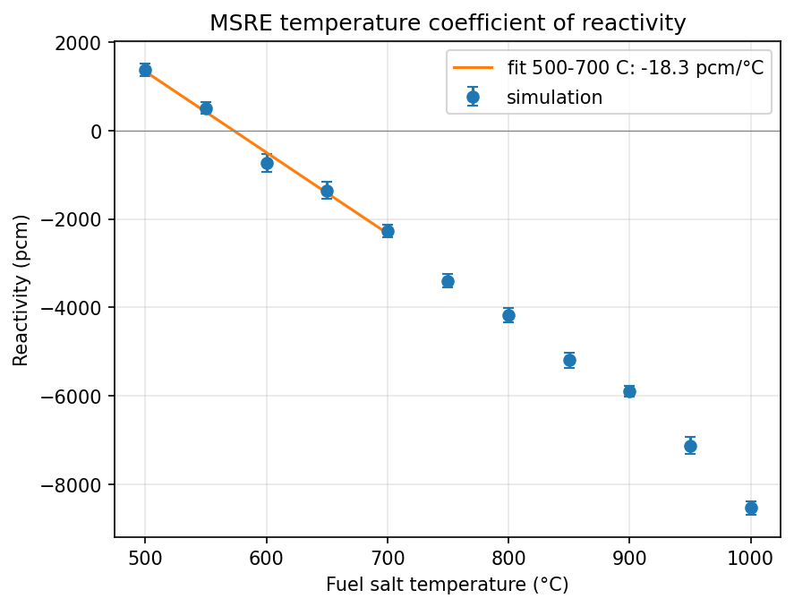

# MSRE Temperature Coefficient of Reactivity Study

A CAD-based Monte Carlo neutron transport study of the Molten Salt Reactor Experiment (MSRE), built with [OpenMC](https://openmc.org) and DAGMC. The goal of this project is to measure the MSRE's **temperature coefficient of reactivity** and compare the result against historical measurements from Oak Ridge National Laboratory.

## Attribution

This project builds on the MSRE CAD model developed by **Copenhagen Atomics / the openmsr project**, and follows the OpenMC/DAGMC workflow demonstrated in their tutorial:

- CAD model source: [openmsr/msre](https://github.com/openmsr/msre) (GPL-3.0)
- Tutorial video: [OpenMC Tutorial | Converting the World's Most Detailed MSRE CAD Model to Simulation](https://www.youtube.com/watch?v=ACPehDVfUrE)

The base geometry (CAD `.step` files), material definitions, and the initial criticality script follow that tutorial. Everything from the temperature coefficient study onward — temperature-dependent salt density coupling, the reactivity sweep, and the analysis — is my own extension.

## Background

A reactor's temperature coefficient of reactivity, α = Δρ/ΔT, describes how reactivity responds to a change in temperature. A **negative** coefficient means that heating the core reduces reactivity, so power excursions are self-limiting: rising power → rising temperature → falling reactivity → falling power. The MSRE was designed to exhibit strongly negative feedback through two mechanisms:

1. **Doppler broadening** — higher fuel temperature broadens absorption resonances, increasing parasitic neutron capture.
2. **Fuel salt thermal expansion** — because the fuel is a liquid, heating reduces its density and pushes fissile material out of the core region.

This study models both effects by coupling the fuel salt's temperature and density to a single parameter and sweeping it across a range of temperatures.

## Model

- **Geometry:** CAD-based (DAGMC) model of the MSRE core, reactor pit, and control rod, converted from `.step` files to `.h5m` surface meshes.
- **Materials:** LiF-BeF₂-ZrF₄-UF₄ fuel salt, graphite moderator, INOR-8 vessel, Inconel-600 and SS316 structural components, at component-appropriate temperatures.
- **Nuclear data:** ENDF/B-VIII.0, with temperature interpolation enabled.
- **Salt density:** temperature-dependent, using the ORNL-3913 experimental correlation:

  ρ (g/cm³) = 2.848 − 7.693×10⁻⁴ · T (°C)

- **Code:** OpenMC 0.14.0, k-eigenvalue mode.

## Method

1. Set the fuel salt temperature `salt_temp` (°C). Salt, graphite, and vessel temperatures and the salt density update from this single parameter.
2. Run the k-eigenvalue simulation and record combined k-effective and its uncertainty.
3. Convert to reactivity: ρ = (k − 1)/k.
4. Repeat across a range of salt temperatures.
5. Fit reactivity vs. temperature; the slope is the temperature coefficient α.

## Results

## Results

A sweep of the fuel salt temperature from 500 °C to 1000 °C in 50 °C steps was run at 50 batches (10 inactive) × 10,000 particles per batch. In this model the salt, graphite moderator, and INOR-8 vessel are all set to the same temperature, so the measured quantity is the **isothermal** temperature coefficient — the response to heating the whole core uniformly — rather than the fuel-only coefficient.

| Salt temp (°C) | k-effective | ± σ (k) | Reactivity (pcm) | ± σ (pcm) |
|---|---|---|---|---|
| 500 | 1.013936 | 0.001473 | +1374.4 | 143.3 |
| 550 | 1.005109 | 0.001291 | +508.3 | 127.8 |
| 600 | 0.992802 | 0.002025 | −725.0 | 205.4 |
| 650 | 0.986640 | 0.001913 | −1354.1 | 196.6 |
| 700 | 0.977799 | 0.001347 | −2271.0 | 141.0 |
| 750 | 0.967159 | 0.001436 | −3395.6 | 153.5 |
| 800 | 0.959889 | 0.001519 | −4178.7 | 164.9 |
| 850 | 0.950695 | 0.001538 | −5186.2 | 170.2 |
| 900 | 0.944324 | 0.001074 | −5895.9 | 120.4 |
| 950 | 0.933517 | 0.001662 | −7121.8 | 190.7 |
| 1000 | 0.921383 | 0.001280 | −8532.5 | 150.8 |

Reactivity is computed as ρ = (k − 1)/k and reported in pcm (10⁻⁵ Δρ).

**Measured isothermal temperature coefficient, fitted over 500–700 °C:**

> **α = −18.3 ± 1.0 pcm/°C**

The model crosses criticality (k = 1) at approximately 560 °C. Over the 500–700 °C range the reactivity falls by about 3600 pcm, which is roughly 5.6 dollars taking β ≈ 650 pcm for ²³⁵U — that is, a 200 °C excursion suppresses itself by more than five dollars of reactivity.



### Comparison with ORNL values

Prince and Engel derived importance-averaged temperature coefficients for the MSRE of −4.4 × 10⁻⁵ /°F for the fuel and −7.3 × 10⁻⁵ /°F for the graphite, for a reactor fueled with salt containing no thorium. Converting to per-°C and summing gives an isothermal coefficient of approximately **−21.1 pcm/°C** (fuel −7.9, graphite −13.1).

| Quantity | This work | ORNL (Prince & Engel) |
|---|---|---|
| Isothermal coefficient | −18.3 ± 1.0 pcm/°C | ≈ −21.1 pcm/°C |

The agreement is within about 13%. Because this model heats salt and graphite together, the comparison is to the *sum* of the two ORNL coefficients rather than to either individually.

### Limitations

Several known differences between this model and the MSRE benchmark plausibly account for the remaining discrepancy:

- **Only the fuel salt expands.** Salt density is coupled to temperature via the ORNL-3913 correlation, but graphite and vessel densities and all component dimensions are held fixed. Thermal expansion of the graphite is therefore not represented.
- **Geometry composition.** The core, reactor pit, and control rod are loaded as three separate DAGMC universes rather than the merged geometry used in the tutorial, giving a different leakage fraction (≈0.217) and absolute k than the benchmark model.
- **Control rod position** is fixed at the position inherited from the base model and was not matched to any specific ORNL experimental configuration.
- **Density correlation extrapolation.** The ORNL-3913 correlation is applied across the full 500–1000 °C sweep. The quoted coefficient is fitted only over 500–700 °C, within the MSRE's operating regime; points above 700 °C are shown to illustrate the trend and involve extrapolation of the correlation beyond the conditions in which the salt was characterized. Over 700–1000 °C the fitted slope steepens to roughly −21 pcm/°C, but this region is outside the range in which the density correlation can be relied on.
- **Coefficients are not decomposed.** Separating the fuel and graphite contributions would require independent temperature variables for the two materials and is not done here.


## Repository contents

| File | Description |
|---|---|
| `msre_critical.py` | Main OpenMC model and k-eigenvalue run script |
| `step_to_h5m.py` | Converts CAD `.step` files to DAGMC `.h5m` meshes |
| `*.step` | MSRE CAD geometry, from [openmsr/msre](https://github.com/openmsr/msre) (GPL-3.0) |

Large generated files (`.h5m` meshes, statepoint and summary files) are not tracked and can be regenerated from the scripts.

## Reproducing

```bash
micromamba activate <env-with-openmc-and-dagmc>
python step_to_h5m.py      # regenerate .h5m geometry from .step files
python msre_critical.py    # run the simulation
```

Mesh notes: The conversion must use the stl2 backend (as in step_to_h5m.py); the older stl backend produces meshes with transport-breaking leaks. check_watertight reports a small number of topological defects in the core mesh (252 of ~3.5M edges unmatched, 15 of 22,333 surfaces unsealed). These are reproduced identically by the conversion script at default settings and are present in the mesh used for all results here; no lost particles occur during transport, so they do not affect results. Note also that this model composes the core, pit, and control rod as three separate DAGMC universes rather than the merged geometry shown in the tutorial video, so absolute k-effective and leakage differ from the video's results; the temperature coefficient study depends only on relative changes across a fixed geometry.

Requires OpenMC 0.14.0 with DAGMC support and the ENDF/B-VIII.0 HDF5 data library (`OPENMC_CROSS_SECTIONS` must point to its `cross_sections.xml`).

## References

1. W. R. Grimes et al., *Reactor Chemistry Division Annual Progress Report for Period Ending January 31, 1965*, ORNL-3913, Oak Ridge National Laboratory (1965) — fuel salt density correlation, d = 2.848 − 7.693 × 10⁻⁴ · t(°C).
2. B. E. Prince and J. R. Engel, *Temperature and Reactivity Coefficient Averaging in the MSRE*, Oak Ridge National Laboratory — importance-averaged fuel and graphite temperature coefficients. https://www.osti.gov/biblio/4768339
3. R. C. Robertson, *MSRE Design and Operations Report Part I: Description of Reactor Design*, ORNL-TM-0728, Oak Ridge National Laboratory (1965).
4. D. Shen and M. Fratoni, "Benchmark Evaluation of Reactivity Effects and Reactivity Coefficients in the Molten Salt Reactor Experiment," *EPJ Web of Conferences* (PHYSOR 2020). https://www.epj-conferences.org/articles/epjconf/pdf/2021/01/epjconf_physor2020_06043.pdf
5. P. K. Romano et al., "OpenMC: A state-of-the-art Monte Carlo code for research and development," *Annals of Nuclear Energy* **82**, 90–97 (2015).
6. MSRE CAD model and OpenMC/DAGMC workflow: openmsr/msre, Copenhagen Atomics (GPL-3.0). https://github.com/openmsr/msre


## License

This repository is licensed under the **GNU General Public License v3.0**, consistent with the upstream MSRE CAD model from [openmsr/msre](https://github.com/openmsr/msre). The CAD geometry remains the work of Copenhagen Atomics / the openmsr project; my scripts and analysis are released under the same terms.


